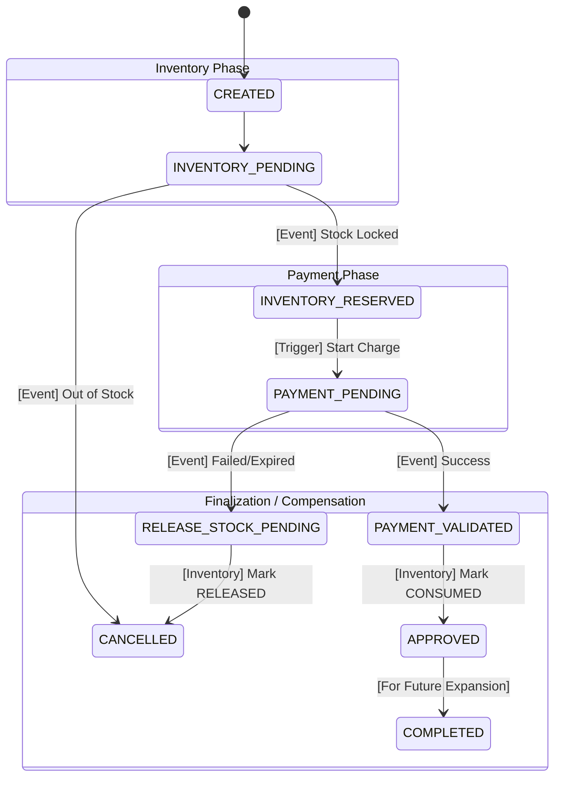

# SYSTEM REQUIREMENTS DOCUMENT

## The Business Goal

A system that allows users to place orders for products. If a payment is successful, the inventory must be deducted. If the inventory is out of stock, the payment must be refunded immediately. The system must never charge a user twice for the same order, even if they have a bad internet connection.

## 1. Service Boundary (Digital Lifecycle only)

- Order Service: Does not cover 'CANCEL' requested by user cases; only 2 services can decice the lifecycle of an order - payment, inventory

- Payment Service: Must verify Order status before finalizing a payment to handle late webhooks.

- State Machine:

- Service Responsibility Matrix:

| Service | Primary Responsibility | Side Effect / Extension Responsibility |
| :---: | :--- | :--- |
| Order | Maintaining the "Source of Truth" for Order State. | Orchestrating compensation if Payment/Inventory fails. Bridge to Logistics: Once in APPROVED, it acts as the trigger for the future Shipping/Packaging services. |
| Inventory | Guarding stock levels (Available vs. Reserved). | Expiring locks that haven't been "Consumed" by a payment. Transitions Reservation from ACTIVE to CONSUMED upon payment success. |
| Payment | Interfacing with 3rd party gateways. | Ensuring "Exactly Once" charging via Idempotency. Must handle the "Late Success" edge case by refunding if the Order has already timed out. |

## 2. Communication Strategy

Flow (Order -> Inventory -> Payment -> Inventory) - Reserved Pattern:

- Order -> Inventory (Sync): The user needs to know immediately if the item is out of stock. We shouldn't tell them "Order Placed" only to email them 5 minutes later saying "Actually, we don't have it."

- Inventory -> Payment (Async): Payment gateways (Stripe, PayPal) are slow and can time out. We don't want to keep a web request hanging for 30 seconds. If the Payment Service is down, the Message Queue (RabbitMQ/Kafka) will retry automatically without the user having to click "Buy" again.

- Payment -> Inventory (Async): Updating stock is a "background" task. It doesn't matter if it happens 1 second or 5 seconds after the failure, as long as it happens eventually (Eventual Consistency).

## 3. Failure Scenarios

- Imagine the Payment Service successfully charges the user's credit card, but then the Order Service crashes before it can record the success.

> **Ans:** Use The "Outbox Pattern"; instead of a Cron job looking at memory, the Payment Service writes the "Success" to its own DB and a "Task" table in the same transaction. A worker then polls that DB table.
