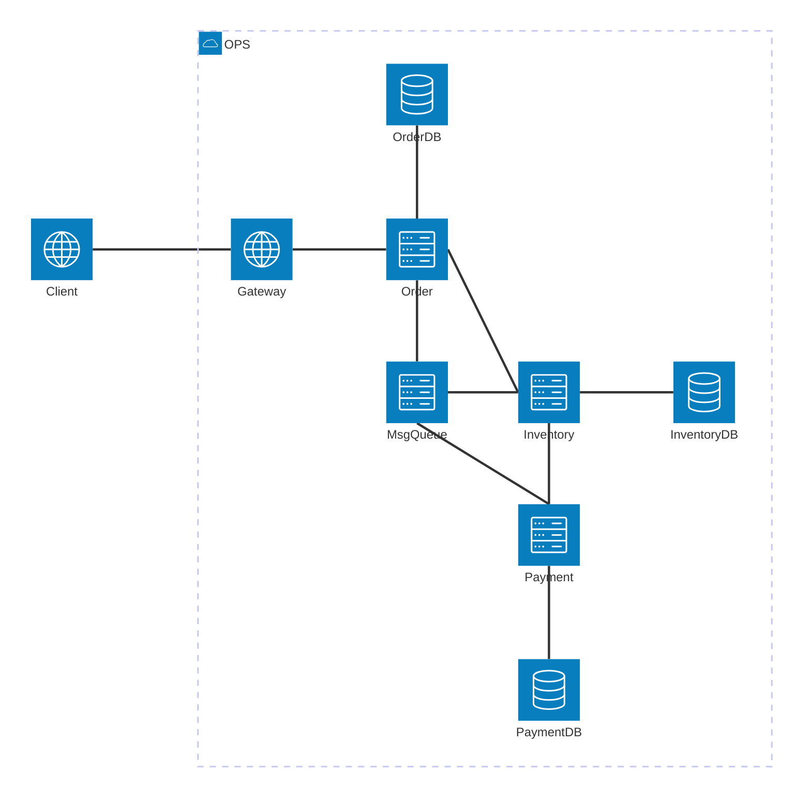
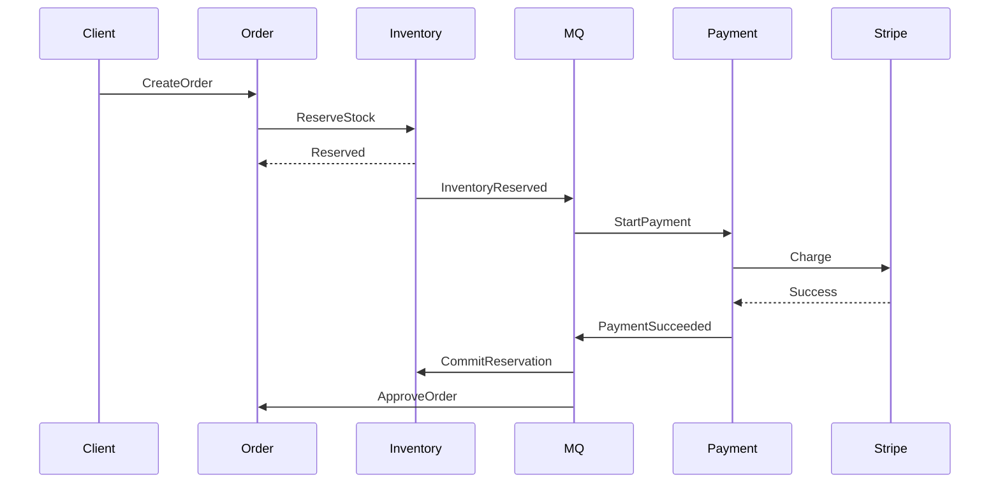
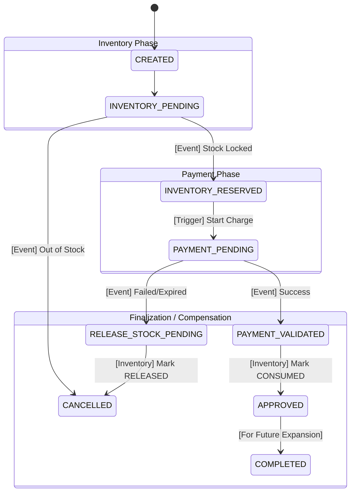

# SYSTEM REQUIREMENTS DOCUMENT

## The Business Goal

A system that allows users to place orders for products. If a payment is successful, the inventory must be deducted. If the inventory is out of stock, the payment must be refunded immediately. The system must never charge a user twice for the same order, even if they have a bad internet connection.

## Assumptions

- Peak traffic: `100 orders/min`
- Single region deployment
- PostgreSQL as primary database
- Eventual consistency is acceptable
- Inventory reservation `TTL = 15 mins`
- Stripe webhook latency can exceed 30s

## Service Boundary (Digital Lifecycle only)

- Order Service: Does not cover `CANCEL` requested by user cases; only 2 services can decice the lifecycle of an order - payment, inventory

- Payment Service: Must verify Order status before finalizing a payment to handle late webhooks.

- Service Responsibility Matrix:

| Service | Primary Responsibility | Side Effect / Extension Responsibility |
| :---: | :--- | :--- |
| Order | Maintaining the "Source of Truth" for Order State. | Orchestrating compensation if Payment/Inventory fails. Bridge to Logistics: Once in `APPROVED`, it acts as the trigger for the future Shipping/Packaging services. |
| Inventory | Guarding stock levels (Available vs. Reserved). | Expiring locks that haven't been "Consumed" by a payment. Transitions Reservation from `ACTIVE` to `CONSUMED` upon payment success. |
| Payment | Interfacing with 3rd party gateways. | Ensuring "Exactly Once" charging via Idempotency. Must handle the "Late Success" edge case by refunding if the Order has already timed out. |

## System Overview Diagram

## Communication Strategy

Flow (Order -> Inventory -> Payment -> Inventory) - Reserved Pattern:

- Order -> Inventory (Sync + Timeout + Circuit Breaker): Immediate stock validation is critical for the user experience. By using a synchronous call with strict Timeouts and a Circuit Breaker, the system ensures the user receives an instant "Out of Stock" error if the item is unavailable or the Inventory Service is struggling. This prevents the "phantom order" scenario where a user receives a confirmation email only to have it revoked minutes later due to stock discrepancies.

- Inventory -> Payment (Async): Payment gateways (Stripe, PayPal) are slow and can time out. We don't want to keep a web request hanging for 30 seconds. If the Payment Service is down, the Message Queue (RabbitMQ/Kafka) will retry automatically without the user having to click "Buy" again.

- Payment -> Inventory (Async): Updating stock is a "background" task. It doesn't matter if it happens 1 second or 5 seconds after the failure, as long as it happens eventually (Eventual Consistency).

## Sequence Diagrams

### Successful Order Fulfillment

## Failure Scenarios

- Imagine the Payment Service successfully charges the user's credit card, but then the Order Service crashes before it can record the success.

> **Ans:** Use The "Outbox Pattern"; instead of a Cron job looking at memory, the Payment Service writes the "Success" to its own DB and a "Task" table in the same transaction. A worker then polls that DB table.

- A user clicks "Pay" and the request reaches Stripe, but their internet cuts out before the Payment Service can receive the response. They immediately refresh and click "Pay" again. How does the system prevent a double charge?

> **Ans:** Implement Idempotency Keys. The Order Service generates a unique UUID for the payment attempt and passes it to the Payment Service. The Payment Service sends this key to Stripe. If Stripe receives the same key twice, it returns the result of the first transaction instead of creating a second charge.

- A "Late Success" occurs: The Inventory Service releases a reservation because the 15-minute TTL expired, but Stripe sends a "Success" webhook 20 minutes later. The item is now sold out. How is this resolved?

> **Ans:** The Payment Service must perform a Synchronous Status Check with the Order Service before processing the webhook. If the Order Service reports the order is `EXPIRED` or `CANCELLED`, the Payment Service immediately triggers a refund through the gateway and marks the payment as `REFUNDED_LATE_SUCCESS`.

## State Machine Diagrams

## Consistency Model

- Message delivery is `AT-LEAST-ONCE`
- Consumers must be idempotent
- Order state transitions are protected with optimistic locking
- Inventory reservation is eventually consistent
- Payment provider webhooks are unordered and retryable
- Duplicate events are expected behavior

## Retry Policy

- MQ retries: exponential backoff
- Max retries: 5
- Poison messages -> DLQ
- DLQ requires manual replay tooling
- Inventory reservation expiration handled by scheduled worker

## Idempotency Rules

Order Service:
- Unique constraint on `idempotency_key`

Payment Service:
- External provider idempotency key reused across retries

Consumers:
- `event_id` stored in ProcessedEvents table
- duplicate events ignored

## Event Versioning Strategy

Rules:
- Events are append-only
- Consumers must ignore unknown fields
- Breaking changes require new event type/version

## Message Ordering

State transitions are monotonic.
Terminal states:
- `APPROVED`
- `CANCELLED`
- `REFUNDED`
- `COMPLETTED`

Terminal states reject older events.

## Webhook Guarantees

- Stripe webhooks may arrive multiple times
- Webhooks may arrive out of order
- Webhooks may be delayed for minutes
- Internal payment state is eventually reconciled against provider state

## Inventory Sync Called By Order

- Inventory sync timeout: 2s
- Circuit breaker opens after 5 failures
- Fallback returns `TEMPORARILY_UNAVAILABLE`

## Inventory Concurrency Protection

| Action | Condition | State Change | Failure Handling |
|:---:|---|---|---|
| Reserve Stock | `available >= quantity` | `available - qty`, `reserved + qty` | Return "Out of Stock" (409 Conflict) |
| Commit Stock | `reserved >= quantity` | `reserved - qty` | Log critical error (Inconsistent State) |
| Release Stock | `reserved >= quantity` | `available + qty`, `reserved - qty` | Log warning (Likely expired TTL) |

## Capacity Estimates

- Peak: `100 orders/min`
- Average payload: `5KB`
- Expected DB writes/order: `8-12`
- MQ throughput target: `500 msg/min`

## Observability

Metrics:
- order_creation_latency
- inventory_reservation_failures
- payment_success_rate
- MQ retry count

Tracing:
- CorrelationId propagated across services

Logging:
- Structured JSON logging
- event_id included in all logs

## Security

- Internal APIs authenticated via mTLS/API keys
- Gateway performs JWT validation
- PII encrypted at rest
- Idempotency keys scoped per customer
- Sensitive payment data never stored
